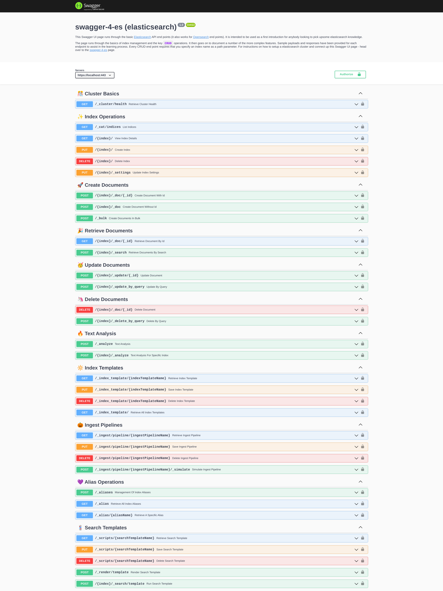

# swagger-4-es

`swagger-4-es` provides a Swagger UI page for the key elasticsearch (and Opensearch) endpoints. It's aimed at being a training resource to engineers starting off with 
elasticsearch. You may also consider customising the openapi specification (additional endpoints and notes) to become a training resource specific to your organisation.   

See [https://www.swarmee.net/swagger 4 es](https://www.swarmee.net/swagger%204%20es/) for further details. 

### Screenshot
[](./docs/Swagger-UI-Screenshot.png)

### Local Setup
FolloThe following steps run you through running ```swagger-4-es``` swagger UI locally.

#### Prerequisite

The following software and configuration is required on your computer to boot up the containers:

- `docker`. See these [docs](https://docs.docker.com/get-docker/) for instructions.
- `docker-compose`. See these [docs](https://docs.docker.com/compose/install/) for instructions.
- Increase the `mmap` count on linux systems. See these [docs](https://www.elastic.co/guide/en/elasticsearch/reference/current/vm-max-map-count.html) for instructions.


#### Usage

```shell
docker-compose up
```

Then open [https://localhost/index.html](https://localhost/index.html) to see the Swagger UI page. The nginx container is setup to forward all to elasticsearch except for URLs ending in ```.json``` or ```.html```. 

**Noting**:

- The Elasticsearch instance will take a little while to boot up - at least 15 seconds (you should see the messages scrolling through on your terminal as it starts up).
- The container starts a nginx reverse proxy to host the Swagger UI page, it generates a self signed certificate so you will need to accept the warning message in your browser. I.e. it is expected to see a `Warning: Potential Security Risk Ahead` message when you open the Swagger UI link (Click Accept Risk and Proceed).
- No authentication is required for the local instance. 

The local instance is also avaliable directly at [http://localhost:9200](http://localhost:9200)

