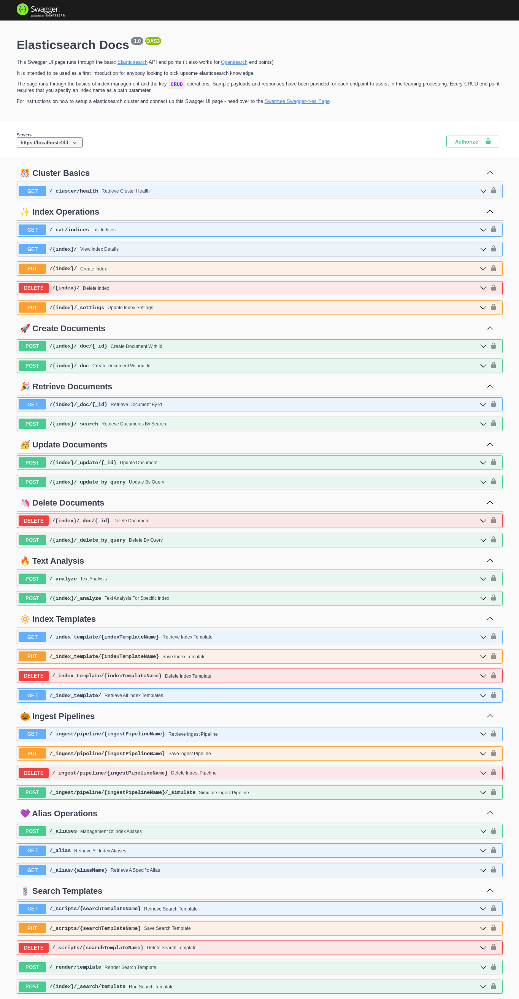

# [Swagger-4-es/os](https://www.swarmee.net/blog/) (Elasticsearch / Opensearch)

## Elasticsearch 7.10 Compatible Cluster with Swagger-UI

The purpose of this repo is to demonstrate how you can setup a Swagger UI page (i.e. an openapi specification) for Elasticsearch/Opensearch endpoints of interest. Why would you want to do this:

- It allows you to build automated tests again the openapi specification using tools like [schemathesis](https://schemathesis.readthedocs.io/en/stable/). So when you want to upgrade elasticsearch you can test the APIs and your configuration are performing the way you expect. The openapi specification can be used to drive your tests by having endpoints that create indexes with data and then query that data.

- Documenting the key endpoints saves a lot of google searching for precise parameters and lets you annotate specific end points (e.g. issues in dev/test check to see if the cluster has gone read-only due to space constraints).

- It's also much more precise and faster to go to a Swagger UI page and hit `try it out` and select a preconfigured payload from a list, than go into dev tools in kibana and write out a payload.

### Prerequisite

The following software and configuration is required on your computer:

- `docker`. See these [docs](https://docs.docker.com/get-docker/) for instructions.
- `docker-compose`. See these [docs](https://docs.docker.com/compose/install/) for instructions.
- Increase the `mmap` count on linux systems. See these [docs](https://www.elastic.co/guide/en/elasticsearch/reference/current/vm-max-map-count.html) for instructions.

### Usage

```shell
docker-compose up
```

Then open [https://localhost/swagger.html](https://localhost/swagger.html) to see the Swagger ui.

**Noting**:

- The Opensearch cluster will take a little while to boot up - at least 15 seconds (you should see the messages scrolling through on your terminal as it starts up).
- The container generates a self signed certificate so you will need to accept the warning message in your browser. It is expected to see a `Warning: Potential Security Risk Ahead` message when you open the Swagger UI link (Click Proceed).
- No authentication is required for the local cluster
- The local cluster is actually a Opensearch cluster - however this is compatible with Elasticsearch 7.10.2.

Then open [https://localhost/swagger.html](https://localhost/swagger.html) to see the Swagger UI page which identifies a number of key endpoints and explains how to use them.

The Elasticsearch cluster is also avaliable directly at [http://localhost:9200](http://localhost:9200)

### Screenshot

Below is what the Swagger UI page looks like;

[](./Swagger-UI-Screenshot.png)

### Technical Details

The way to set this up is very straight forward:

1. Document your schema as a openapi.json file - [Swagger Hub](https://app.swaggerhub.com) can help with this.
2. Copy the `dist` folder from the [Swagger UI](https://github.com/swagger-api/swagger-ui/blob/master/docs/usage/installation.md) github page.
3. Drop in your openapi.json from step one into the same folder as the HTML index file.
4. change the `url` parameter in the `index.html` to "./openapi.json". so it looks like this :

```javascript
const ui = SwaggerUIBundle({
  url: "./openapi.json",
  dom_id: "#swagger-ui",
  defaultModelsExpandDepth: -1,
  defaultModelExpandDepth: -1,
  docExpansion: "none",
  displayRequestDuration: true,
  useUnsafeMarkdown: true,
  deepLinking: true,
  presets: [SwaggerUIBundle.presets.apis, SwaggerUIStandalonePreset],
  plugins: [SwaggerUIBundle.plugins.DownloadUrl],
  layout: "StandaloneLayout",
});
```

It's also possible to include the openapi schema directly in the `index.html` file. To do this replace the `url` parameter with the `spec` parameter and make it equal the openapi schema. 
